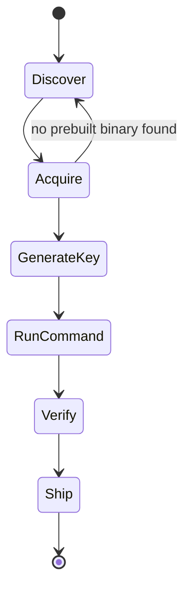
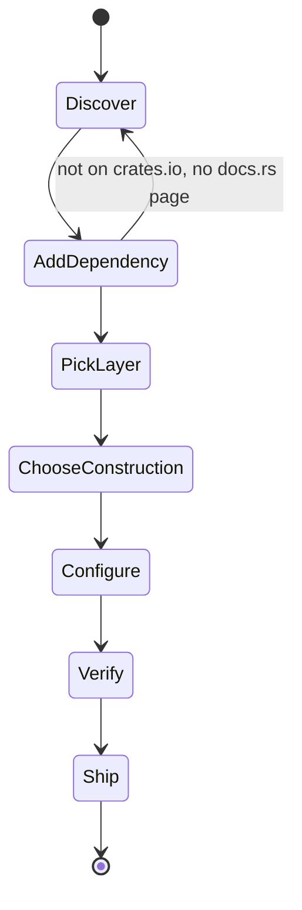
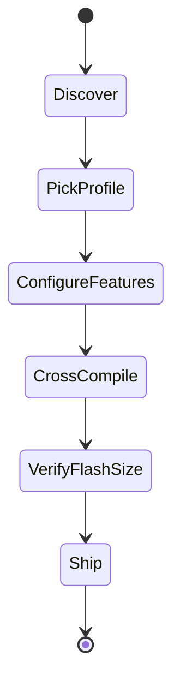

# Persona-based user-journey gap analysis

Requested 2026-07-25, written 2026-07-26 (`TASKS.md` T-114). Distinct from the two gap analyses
that already exist: `docs/release-readiness.md` is organized by *construction* (is this mode of
operation current/safe), and `docs/dstu-crypto-project.md`'s "Concrete API shape" table is organized
by *libsodium function name*. This document is organized by *persona and the sequence of states they
walk through* — discover, integrate, configure, verify, ship — because an existing, correctly-built
feature can still leave a persona stuck if the doc or tooling connecting the steps around it is
missing. This document's value is that framing itself, not a fourth copy of the same feature list —
every "have" cell below cites the file that already says so rather than restating its content.

Three personas, in the order `TASKS.md` T-114 named them.

## Persona 1 — binary user, performance-focused

Picks up `uacrypt` to encrypt/hash/benchmark files from the CLI. Cares about throughput and getting
a runnable binary quickly; does not care about the Rust API or `hazmat`/`crypto_*` split.

`GenerateKey`'s own back-edge to `Discover` (present in the original 2026-07-25 version of this
diagram) is removed as of `TASKS.md` T-115 - `uacrypt keygen` now closes that path, see the table
below.

| State | Want | Have | Gap |
|---|---|---|---|
| Discover | Find the project, understand what it does and its current maturity | `README.md` top banner states v0.1.0 pre-release status plainly | none |
| Acquire | A prebuilt binary for their OS, no Rust toolchain required | **None exists.** `README.md` "Building from source" is the only path (`cargo build -p uacrypt --release`); T-18 (GitHub Releases binaries) is explicitly gated on the owner asking by name, not queued | **Real, blocking gap.** This is the same one T-114's own task text flagged as a candidate — confirmed here, not assumed: a user who doesn't already have `rustup` cannot get `uacrypt` at all today |
| Generate a key | A `uacrypt keygen` command, or at least a documented one-liner | **Closed 2026-07-26, see `TASKS.md` T-115.** `uacrypt keygen --out key.bin` now exists — draws a fresh 32-byte key from the OS CSPRNG via `crypto_secretstream::Key::generate`, writes it in the exact format `encrypt`/`decrypt --key` expect | none, as of T-115 |
| Run `encrypt`/`decrypt`/`hash` | A misuse-resistant command with no mode/nonce to configure | `README.md` "Using `uacrypt`" documents `encrypt`/`decrypt`/`hash` fully, including that they're genuinely chunked (T-40/D-68) with no message-length cap | none, once a key exists |
| Verify it does what's claimed | Confirm round-trip correctness and see real throughput numbers | `cargo test --workspace` for correctness; `PERFORMANCE.md` "Binary-level (process) comparison" section for real `uacrypt`-binary MB/s numbers, `docs/resource-profiles.md` for the `fused`/`small-tables` speed table | none — but both require building from source (same toolchain dependency as Acquire) |
| Ship | Deploy the binary into their own workflow/pipeline | No install-script, package-manager entry (Homebrew/Scoop/apt), or Docker image exists; not tracked as a task anywhere | Gap, but downstream of and smaller than the Acquire gap above — not worth its own task until T-18 lands |

**Bottom line**: this persona is blocked at the second state (Acquire) without a Rust toolchain, and
blocked again at the third (GenerateKey) even with one. Both are cheap, concrete, and previously
absent from `release-readiness.md`'s per-construction framing.

## Persona 2 — library user, performance-focused

Depends on `dstu-core` directly from `Cargo.toml`. Cares about the `crypto_*`/`hazmat` split,
`ExpandedKey`-style cached-schedule paths, and `PERFORMANCE.md`'s numbers.

| State | Want | Have | Gap |
|---|---|---|---|
| Discover | Find the crate and its API surface | `README.md`, `crates/dstu-core/README.md` | none |
| Add dependency | `cargo add dstu-core` | **Not published to crates.io** (T-17, explicitly gated on an owner request per the roadmap's Step 4 note, `TASKS.md` line ~2031). Only path today is a git dependency (`dstu-core = { git = "...", branch = "master" }`) | **Real gap, and it compounds another one**: because the crate isn't published, `docs.rs` has never built a page for it either — meaning T-110's `[package.metadata.docs.rs]` `all-features = true` metadata (done, `TASKS.md` T-110) is currently inert. A library user reading only crates.io/docs.rs (the normal Rust discovery path) finds nothing there at all; they'd have to already know to look at GitHub |
| Pick layer | Understand `hazmat::*` vs `crypto_*` and which to reach for | `crates/dstu-core/README.md` "Two layers" section states the split plainly and by name; `docs/dstu-crypto-project.md` "Concrete API shape" has the full module-by-module table | none |
| Choose construction | Know which `crypto_*`/`hazmat` module fits their use case (AEAD, KDF, signing, streaming...) | `docs/release-readiness.md` "Use-case coverage" table maps scenario → construction directly | none |
| Configure (features, cached schedule) | Know which Cargo features to enable, and how to use `ExpandedKey` for repeated-key throughput | `crates/dstu-core/README.md` "Feature flags" table; `hazmat::kalyna`'s `ExpandedKey` type itself — but **no doc page walks through *why*/*when* to use `ExpandedKey` over the bare `encrypt`/`decrypt` functions**, only `PERFORMANCE.md`'s benchmark methodology mentions "cached schedule" in passing (e.g. the `resource-profiles.md` speed table's row labels) | **Minor gap**: a library user optimizing for throughput has to infer the cached-schedule pattern from benchmark row labels rather than being told directly in `dstu-core`'s own README or rustdoc |
| Verify | Confirm the crate does what it claims, on their own machine | `cargo test --workspace --all-features`; `PERFORMANCE.md`'s full benchmarking + `criterion` baseline instructions (`cargo bench -p dstu-core --bench kalyna --bench kupyna --bench strumok`) | none, once the dependency itself is resolved |
| Ship | Depend on a stable, versioned release for their own downstream users | No stable crates.io version exists; a git-dependency consumer has no SemVer guarantee across commits, and `CHANGELOG.md` (T-111, done) currently has no public release to anchor to | Same root cause as "Add dependency" above — not a separate gap, a downstream consequence of T-17 |

**Bottom line**: every step from "Pick layer" onward is well documented and cited; the entire
persona-2 gap is concentrated at "Add dependency" (no crates.io/docs.rs presence) and its
downstream consequence for "Ship." This is the same T-17 gate the roadmap already tracks — this
persona view just shows it's not only a publishing-hygiene item, it's a hard stop partway through a
concrete adoption path.

## Persona 3 — constrained-target (microcontroller) user

Needs the `no_std`/`small-tables` minimal-footprint variant for an STM32/ESP32-class target. Cares
about flash/RAM budget and build-time feature selection, not raw throughput.

`CrossCompile`'s back-edge to `Discover` (present in the original 2026-07-25 version of this
diagram, labeled "no target ever actually built here") is removed as of `TASKS.md` T-116 - real
cross-compiles now exist for two target families, see the table below. `VerifyFlashSize` still has
no real linked-artifact measurement behind it (see that row) - not yet a fully closed state.

| State | Want | Have | Gap |
|---|---|---|---|
| Discover | Understand `no_std` support exists and what it means concretely | `README.md` "Embedded / `no_std` targets" section; `CLAUDE.md` MVP scope states the no-hardware-lock-in goal explicitly | none |
| Pick profile | Decide `fused` vs `small-tables` for their flash budget | `docs/resource-profiles.md` "Which one do I need?" sizing table, by target family and typical flash size | none |
| Configure features | Know the exact Cargo invocation | `docs/resource-profiles.md` "How to build each" section gives the literal `cargo build --no-default-features --features small-tables` commands | none |
| Cross-compile to a real target | Build (even just build, not flash) for `thumbv7em-none-eabihf` (STM32) or an Xtensa/RISC-V ESP32 target | **Closed 2026-07-26, see `TASKS.md` T-116.** All 4 `no_std`/`alloc`/`small-tables` combinations, both dev and release profiles, now build clean for `thumbv7em-none-eabihf` (STM32 Cortex-M) and `riscv32imc-unknown-none-elf` (ESP32-C3-class RISC-V), both installed via plain `rustup target add` | Xtensa (the *other* ESP32 family) needs a custom toolchain (`espup`, not plain `rustup`) and was not attempted - a smaller, separately-flaggable remaining gap, not the sharp one this row used to describe |
| Verify flash size | Confirm the ~86 KB / ~6.1 KB table numbers translate to a real linked binary on their target | T-116 also produced a real `thumbv7em-none-eabihf` release-profile `.rlib` size (1.4 MB `fused` / 1.2 MB `small-tables`) alongside `docs/resource-profiles.md`'s existing source-constant-derived table | **Still open, explicitly** - an `.rlib` isn't a linked, dead-code-eliminated firmware image, so this isn't the same number a real flashed binary would show. Closing this fully needs an actual firmware binary crate (entry point, panic handler, `memory.x`) that doesn't exist in this repo - flagged as a further candidate, not self-assigned |
| Ship | Flash and run on real hardware | Phase 4 (T-55/T-56), explicitly post-MVP | Correctly out of scope, not a gap against this roadmap |

**Bottom line**: persona 3's journey now has real cross-compiled evidence behind the "compiles for
microcontroller targets" claim (T-116), closing this document's sharpest original finding. What
remains open is narrower than before: Xtensa specifically (needs `espup`, not attempted), and a true
linked flash-size measurement (needs a firmware binary crate this repo doesn't have) - both smaller
asks than the original "has anyone ever tried this" gap.

## Cross-persona findings

- **The single highest-value finding when this document was first written**: persona 3's
  cross-compile gap. It sat directly behind a claim `README.md` already made in careful, hedged
  language — the hedge was correct, but the thing it was hedging *against verifying* had never been
  attempted. **Closed 2026-07-26, see `TASKS.md` T-116** — real cross-compiles now exist for two
  target families (thumbv7em/STM32, riscv32imc/ESP32-C3-class), no hardware required to get there.
- **`uacrypt keygen`'s absence** (persona 1) was already-tracked at the construction level
  (`randombytes` "Done") but read very differently once framed as "can this specific persona finish
  their journey" — the answer was no, at the very first concrete step. **Closed 2026-07-26, see
  `TASKS.md` T-115** — the project owner triaged this candidate into a real task the same day it
  was found.
- **Crates.io/docs.rs absence** (persona 2) is the same shape of gap, still open — tracked at the
  construction level as T-17, explicitly gated on an owner request rather than queued automatically.
- The three findings above were not proposed as new task numbers when this document was first
  written, per T-114's own scope ("this task's value is the persona/journey framing itself") — they
  were recorded as candidates for the project owner to triage. Two (`uacrypt keygen`, T-115; the
  cross-compile check, T-116) have since been triaged and closed; crates.io publication (T-17)
  remains open, still explicitly gated on an owner request.
