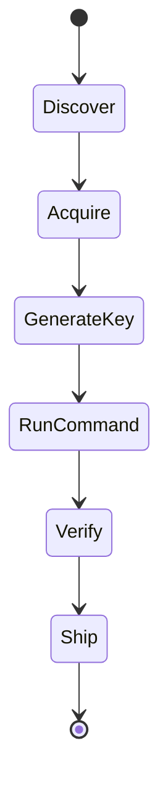
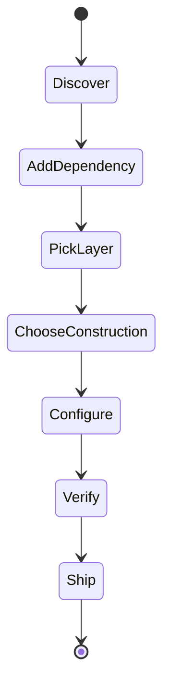
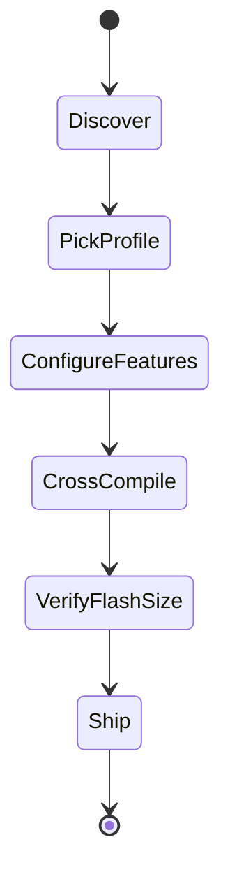
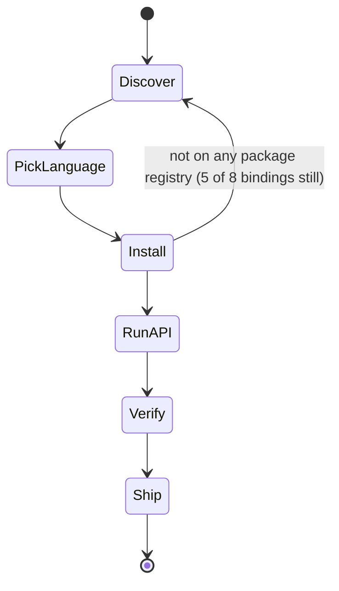
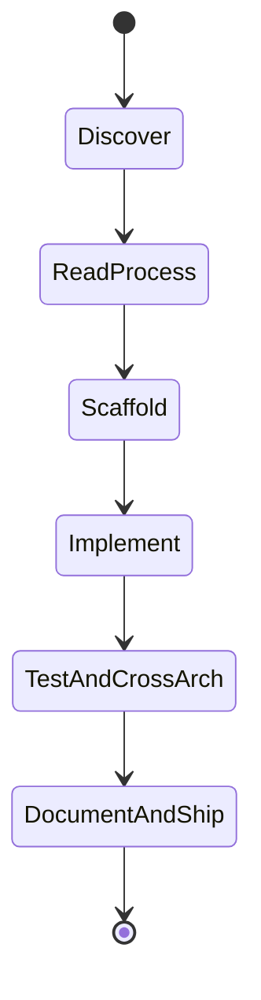

# Persona-based user-journey gap analysis

Requested 2026-07-25, written 2026-07-26 (`docs/TASKS.md` T-114). Distinct from the two gap analyses
that already exist: `docs/release-readiness.md` is organized by *construction* (is this mode of
operation current/safe), and `docs/dstu-crypto-project.md`'s "Concrete API shape" table is organized
by *libsodium function name*. This document is organized by *persona and the sequence of states they
walk through* — discover, integrate, configure, verify, ship — because an existing, correctly-built
feature can still leave a persona stuck if the doc or tooling connecting the steps around it is
missing. This document's value is that framing itself, not a fourth copy of the same feature list —
every "have" cell below cites the file that already says so rather than restating its content.

Five personas: the original three from `docs/TASKS.md` T-114, plus two added 2026-08-03
(`docs/TASKS.md` T-166) once every planned language binding (Python, Node.js, Ruby, PHP, .NET,
Java, Go, C++) and the C ABI crate existed — the original three predate all of Phase 3 and have no
persona for "uses `uacrypt` from another language" or "contributes to a binding."

## Persona 1 — binary user, performance-focused

Picks up `uacrypt` to encrypt/hash/benchmark files from the CLI. Cares about throughput and getting
a runnable binary quickly; does not care about the Rust API or `hazmat`/`crypto_*` split.

`Acquire`'s and `GenerateKey`'s back-edges to `Discover` (both present in the original 2026-07-25
version of this diagram, labeled "no prebuilt binary found" and "no keygen tool found"
respectively) are both removed now - `docs/TASKS.md` T-18/T-119 and T-115 close each path, see the
table below.

| State | Want | Have | Gap |
|---|---|---|---|
| Discover | Find the project, understand what it does and its current maturity | `README.md` top banner states its current released version plainly (`v0.3.8` as of 2026-08-13 - `docs-check`'s version-marker lint, T-186, keeps this from silently drifting) | none |
| Acquire | A prebuilt binary for their OS, no Rust toolchain required | **Closed 2026-07-26, see `docs/TASKS.md` T-18/T-119.** Every GitHub Release (first `v0.1.0`, latest `v0.3.8` as of 2026-08-13) ships `uacrypt-{linux-x86_64,macos-aarch64,windows-x86_64}` archives, built by `.github/workflows/release.yml` on a tag push. Verified against the actual downloaded Windows asset, not just a green CI run: extracted and ran standalone (no local `cargo`), `--version`/`keygen`/`encrypt`/`decrypt` round-trip all worked | macOS asset is `aarch64`-only (GitHub's `macos-latest` runner) - an Intel Mac build isn't covered, not previously scoped. `box-*`/`box-*512` (DSTU 9041/`crypto_box`/`crypto_box512`) and `sign*257` shipped in v0.3.0+, no longer `master`-only |
| Generate a key | A `uacrypt keygen` command, or at least a documented one-liner | **Closed 2026-07-26, see `docs/TASKS.md` T-115.** `uacrypt keygen --out key.bin` now exists — draws a fresh 32-byte key from the OS CSPRNG via `crypto_secretstream::Key::generate`, writes it in the exact format `encrypt`/`decrypt --key` expect | none, as of T-115 |
| Run `encrypt`/`decrypt`/`hash` | A misuse-resistant command with no mode/nonce to configure | `README.md` "Using `uacrypt`" documents `encrypt`/`decrypt`/`hash` fully, including that they're genuinely chunked (T-40/D-68) with no message-length cap | none, once a key exists |
| Verify it does what's claimed | Confirm round-trip correctness and see real throughput numbers | `cargo test --workspace` for correctness; `docs/PERFORMANCE.md` "Binary-level (process) comparison" section for real `uacrypt`-binary MB/s numbers, `docs/resource-profiles.md` for the `fused`/`small-tables` speed table | For a *downloaded* binary specifically: correctness is now verifiable without a toolchain (the round-trip smoke test above), but the MB/s numbers still require building from source to reproduce - not re-measured per-platform for the release assets themselves |
| Ship | Deploy the binary into their own workflow/pipeline | No install-script, package-manager entry (Homebrew/Scoop/apt), or Docker image exists; not tracked as a task anywhere | Smaller gap now that Acquire itself is closed - still not worth its own task, no evidence yet that a real user needs more than a direct download |

**Bottom line**: this persona's journey is now unblocked end to end. Both the original blockers
(Acquire without a Rust toolchain, GenerateKey even with one) closed the same session they were
found in, T-18/T-119 and T-115 respectively - a real example of this document's stated purpose:
gaps neither `release-readiness.md`'s construction-level view nor `dstu-crypto-project.md`'s
API-mapping table would have framed as "blocking a specific persona," found and closed by walking
the journey directly.

## Persona 2 — library user, performance-focused

Depends on `dstu-core` directly from `Cargo.toml`. Cares about the `crypto_*`/`hazmat` split,
`ExpandedKey`-style cached-schedule paths, and `docs/PERFORMANCE.md`'s numbers.

`AddDependency`'s back-edge to `Discover` (present in the original 2026-07-25 version of this
diagram, labeled "not on crates.io, no docs.rs page") is removed as of T-17's closure, 2026-08-09 -
see the table below.

| State | Want | Have | Gap |
|---|---|---|---|
| Discover | Find the crate and its API surface | `README.md`, `crates/dstu-core/README.md` | none |
| Add dependency | `cargo add dstu-core` | **Closed 2026-08-09, see `docs/DECISIONS.md` D-114/T-17.** `dstu-core` is live on crates.io since v0.3.0; `cargo add dstu-core` works exactly as this row originally wanted. `docs.rs/dstu-core` also builds now (confirmed live, T-110's `all-features = true` metadata is no longer inert) | none |
| Pick layer | Understand `hazmat::*` vs `crypto_*` and which to reach for | `crates/dstu-core/README.md` "Two layers" section states the split plainly and by name; `docs/dstu-crypto-project.md` "Concrete API shape" has the full module-by-module table | none |
| Choose construction | Know which `crypto_*`/`hazmat` module fits their use case (AEAD, KDF, signing, streaming...) | `docs/release-readiness.md` "Use-case coverage" table maps scenario → construction directly. **Fixed 2026-07-26 (`docs/TASKS.md` T-117)**: `crates/dstu-core/README.md`'s own `## Example` (the first code a library user actually copy-pastes, for `crypto_secretbox`) did not compile as written — `SecretKey::generate()`/`seal()` both return `Result`, the example used them as bare values. Found by actually building the example in a real path-dependency scratch crate, not by re-reading the doc; never caught by `cargo test` since the README isn't wired in as a doctest | none, as of the T-117 fix — but this class of bug (an uncompiled README example) is structurally invisible to the existing test suite, so a regression here needs a human/agent to actually run the example again, not just `cargo test` passing |
| Configure (features, cached schedule) | Know which Cargo features to enable, and how to use `ExpandedKey` for repeated-key throughput | `crates/dstu-core/README.md` "Feature flags" table; `hazmat::kalyna`'s `ExpandedKey` type itself — but **no doc page walks through *why*/*when* to use `ExpandedKey` over the bare `encrypt`/`decrypt` functions**, only `docs/PERFORMANCE.md`'s benchmark methodology mentions "cached schedule" in passing (e.g. the `resource-profiles.md` speed table's row labels) | **Minor gap**: a library user optimizing for throughput has to infer the cached-schedule pattern from benchmark row labels rather than being told directly in `dstu-core`'s own README or rustdoc |
| Verify | Confirm the crate does what it claims, on their own machine | `cargo test --workspace --all-features`; `docs/PERFORMANCE.md`'s full benchmarking + `criterion` baseline instructions (`cargo bench -p dstu-core --bench kalyna --bench kupyna --bench strumok`) | none, once the dependency itself is resolved |
| Ship | Depend on a stable, versioned release for their own downstream users | **Closed alongside "Add dependency" above.** `dstu-core`/`uacrypt` are stable, versioned crates.io releases (v0.3.8 as of this writing); `docs/CHANGELOG.md` anchors each one | none |

**Bottom line, updated 2026-09-17**: persona 2's journey is now unblocked end to end. The original
gap ("Add dependency"/"Ship", no crates.io/docs.rs presence) was the one open item in this whole
document as of when it was written - closed 2026-08-09 when T-17 landed (`docs/DECISIONS.md`
D-114). This paragraph is kept, corrected in place rather than deleted, as the historical record of
what this persona's blocking gap used to be.

## Persona 3 — constrained-target (microcontroller) user

Needs the `no_std`/`small-tables` minimal-footprint variant for an STM32/ESP32-class target. Cares
about flash/RAM budget and build-time feature selection, not raw throughput.

`CrossCompile`'s back-edge to `Discover` (present in the original 2026-07-25 version of this
diagram, labeled "no target ever actually built here") is removed as of `docs/TASKS.md` T-116 - real
cross-compiles now exist for two target families, see the table below. `VerifyFlashSize` still has
no real linked-artifact measurement behind it (see that row) - not yet a fully closed state.

| State | Want | Have | Gap |
|---|---|---|---|
| Discover | Understand `no_std` support exists and what it means concretely | `README.md` "Embedded / `no_std` targets" section; `CLAUDE.md` MVP scope states the no-hardware-lock-in goal explicitly | none |
| Pick profile | Decide `fused` vs `small-tables` for their flash budget | `docs/resource-profiles.md` "Which one do I need?" sizing table, by target family and typical flash size | none |
| Configure features | Know the exact Cargo invocation | `docs/resource-profiles.md` "How to build each" section gives the literal `cargo build --no-default-features --features small-tables` commands | none |
| Cross-compile to a real target | Build (even just build, not flash) for `thumbv7em-none-eabihf` (STM32) or an Xtensa/RISC-V ESP32 target | **Closed 2026-07-26, see `docs/TASKS.md` T-116.** All 4 `no_std`/`alloc`/`small-tables` combinations, both dev and release profiles, now build clean for `thumbv7em-none-eabihf` (STM32 Cortex-M) and `riscv32imc-unknown-none-elf` (ESP32-C3-class RISC-V), both installed via plain `rustup target add` | Xtensa (the *other* ESP32 family) needs a custom toolchain (`espup`, not plain `rustup`) and was not attempted - a smaller, separately-flaggable remaining gap, not the sharp one this row used to describe |
| Verify flash size | Confirm the ~86 KB / ~6.1 KB table numbers translate to a real linked binary on their target | T-116 also produced a real `thumbv7em-none-eabihf` release-profile `.rlib` size (1.4 MB `fused` / 1.2 MB `small-tables`) alongside `docs/resource-profiles.md`'s existing source-constant-derived table | **Still open, explicitly** - an `.rlib` isn't a linked, dead-code-eliminated firmware image, so this isn't the same number a real flashed binary would show. Closing this fully needs an actual firmware binary crate (entry point, panic handler, `memory.x`) that doesn't exist in this repo - flagged as a further candidate, not self-assigned |
| Ship | Flash and run on real hardware | Phase 4 (T-55/T-56), explicitly post-MVP | Correctly out of scope, not a gap against this roadmap |

**Bottom line**: persona 3's journey now has real cross-compiled evidence behind the "compiles for
microcontroller targets" claim (T-116), closing this document's sharpest original finding. What
remains open is narrower than before: Xtensa specifically (needs `espup`, not attempted), and a true
linked flash-size measurement (needs a firmware binary crate this repo doesn't have) - both smaller
asks than the original "has anyone ever tried this" gap.

## Persona 4 — binding user, non-Rust developer

Uses `uacrypt`/`dstu-core` from their own language (Python, Node.js, Ruby, PHP, .NET, Java, Go, or
C++) without touching Rust directly. Cares about that language's own idiomatic API and normal
package-registry install path, not `hazmat`/`crypto_*` internals.

**Updated 2026-08-3x/09-17**: the back-edge above narrowed, not closed - Python/Node.js/Ruby are
now on PyPI/npm/RubyGems (see the table below), the remaining five (PHP/.NET/Java/Go/C++) still
build-from-source only.

| State | Want | Have | Gap |
|---|---|---|---|
| Discover | Find out a binding exists for their language | `README.md`'s language-bindings section (T-162); `docs/bindings-strategy.md` | none |
| Pick language | Confirm the binding covers what they need (`crypto_secretstream`, signing, etc.) | Each `bindings/<lang>/README.md` carries the same provisional-status banner (T-112) and documents its wrapped surface | none |
| Install | `pip install`/`npm install`/`gem install`/`composer require`/`nuget install`/a Maven dependency/`go get`/vcpkg — the normal registry path for their language | **Partially closed.** Python (`pip install dstu-core`), Node.js (`npm install dstu-core`), and Ruby (`gem install dstu_core`) are live registries since T-164/D-194 - same closure persona 2's crates.io gap got. PHP/.NET/Java/Go/C++ remain build-from-source only, still gated on a separate owner request per registry (Packagist/NuGet/Maven Central/pkg.go.dev/vcpkg each need their own setup) | **Real gap, narrower than before**: 5 of 8 languages still have no registry presence; a developer in one of those 5 finds nothing on their normal discovery path and has to know to look at GitHub |
| Run the API | Call `crypto_*` functions idiomatically from their own language | `bindings/<lang>/examples/` plus each binding's `README.md` show real usage (standard binding steps, step 7) | none, once installed |
| Verify | Confirm the binding does what it claims, on their own machine | Each binding's local test suite covers all three categories (correctness/rejection/misuse, D-64/D-65) against the shared official vectors (standard binding steps, step 6) | none |
| Ship | Depend on a stable, versioned release for their own downstream users | Python/Node.js/Ruby consumers can now depend on a stable, versioned PyPI/npm/RubyGems release (same closure as persona 2's crates.io gap). PHP/.NET/Java/Go/C++ consumers still cannot | Same root cause as "Install" above for the remaining five — not a separate gap |

**Bottom line, updated 2026-09-17**: persona 4's gap narrowed, didn't close - three of eight
languages (Python/Node.js/Ruby) got the same registry closure persona 2's crates.io gap got
(T-164/D-194), the remaining five (PHP/.NET/Java/Go/C++) are still exactly the gap this section
originally described in full, each gated on its own separate registry setup.

## Persona 5 — binding contributor

Wants to fix, extend, or add a language binding under `bindings/` (or the C ABI crate it's built
on) — distinct from persona 4, who only *consumes* a binding.

| State | Want | Have | Gap |
|---|---|---|---|
| Discover | Find out there's a defined process for contributing to a binding, not just to the core crate | Before this session, **nothing** — `docs/CONTRIBUTING.md` had zero mentions of `bindings/`/`dstu-core-capi` (confirmed by grep, not assumed), written entirely for core-crate contributors and predating all of Phase 3. **Closed the same session, `docs/TASKS.md` T-165** — a "Working on a language binding" section now points to `docs/bindings-strategy.md`'s standard-steps template | none, as of T-165 |
| Read the process | Understand the ten-step template once found | `docs/bindings-strategy.md` "The standard binding steps" (steps 1-10) | none |
| Scaffold | Set up the binding's own crate/project, wired in appropriately | Step 1 of the standard steps; D-119 (each binding is its own separate workspace, never a root workspace member) | none |
| Implement | Wrap the full `crypto_*` surface, including `crypto_secretstream`'s two known pitfalls | Steps 2-3 of the standard steps; D-116/D-118 name both pitfalls explicitly (cleanup-hook finalizing on the error path, unbounded/untrusted wire-format length field) so a contributor doesn't have to rediscover them per language | none, if both are actually re-checked rather than assumed inherited from the wire format |
| Test + cross-arch | Confirm correctness/rejection/misuse locally, and that FFI-boundary code doesn't hide an ARM-specific assumption | Steps 6 and 10 of the standard steps; D-64/D-65 for the three categories, D-151 for the Raspberry Pi ARM64 re-check (which already found one real bug — a hardcoded `i8` test buffer that should have been `c_char`) | none |
| Document + ship | Examples, README, doc-map sweep, one commit per step, opened as a PR | Steps 7-9 of the standard steps; `docs/CONTRIBUTING.md`'s "Opening the PR" section applies unchanged | none |

**Bottom line**: persona 5's only real gap — no onboarding entry point in `docs/CONTRIBUTING.md` —
closed in the same session this persona was added, via T-165. A live instance of this document's
own stated methodology: framing the journey surfaced a gap that a construction-level view (the
standard steps already existed) wouldn't have flagged as "blocking a specific persona from ever
finding the process."

## Cross-persona findings

- **The single highest-value finding when this document was first written**: persona 3's
  cross-compile gap. It sat directly behind a claim `README.md` already made in careful, hedged
  language — the hedge was correct, but the thing it was hedging *against verifying* had never been
  attempted. **Closed 2026-07-26, see `docs/TASKS.md` T-116** — real cross-compiles now exist for two
  target families (thumbv7em/STM32, riscv32imc/ESP32-C3-class), no hardware required to get there.
- **`uacrypt keygen`'s absence** (persona 1) was already-tracked at the construction level
  (`randombytes` "Done") but read very differently once framed as "can this specific persona finish
  their journey" — the answer was no, at the very first concrete step. **Closed 2026-07-26, see
  `docs/TASKS.md` T-115** — the project owner triaged this candidate into a real task the same day it
  was found.
- **Persona 1's Acquire gap (no prebuilt binary, T-18)** was explicitly gated on an owner request,
  same as T-17 - and the owner made that request directly ("зроби реліз на гітгабі бінарника і
  бібліотек"), 2026-07-26. **Closed the same day, see `docs/TASKS.md` T-18/T-119** - real GitHub Release
  `v0.1.0`, three platform binaries plus the `dstu-core` source distribution, verified against the
  actual downloaded assets.
- **Updated 2026-09-17: crates.io/docs.rs absence (persona 2) is closed, not open any more.**
  T-17 landed 2026-08-09 (`docs/DECISIONS.md` D-114) - `dstu-core`/`uacrypt` are both live on
  crates.io, `docs.rs/dstu-core` builds. This was the one gap this document tracked as genuinely
  still open when first written; it no longer is. Paragraph kept as the historical record of what
  that gap used to be, not deleted.
- The findings above were not proposed as new task numbers when this document was first written,
  per T-114's own scope ("this task's value is the persona/journey framing itself") — they were
  recorded as candidates for the project owner to triage. Four (`uacrypt keygen`, T-115; the
  cross-compile check, T-116; prebuilt binaries, T-18/T-119; crates.io publication, T-17) have
  since been triaged and closed - the only originally-open item from this list left is persona 4's
  registry-install gap, and even that one is now three-eighths closed (see below).
- **Personas 4 and 5, added 2026-08-03 (`docs/TASKS.md` T-166)**: the original three personas
  predated every language binding; walking the binding-user and binding-contributor journeys
  directly surfaced two gaps. Persona 5's onboarding gap was closed immediately via T-165 (a
  `docs/CONTRIBUTING.md` section had never existed for bindings at all). Persona 4's
  registry-install gap turned out to be structurally identical to persona 2's (T-164 mirrors T-17,
  both owner-gated) - **updated 2026-09-17: three of eight languages (Python/Node.js/Ruby) are now
  closed the same way persona 2's crates.io gap was (T-164/D-194); PHP/.NET/Java/Go/C++ remain
  open, each needing its own registry setup**. Note: the root `README.md`'s stale repo tree
  (missing `bindings/ruby`/`bindings/php`/`crates/dstu-core-capi`) is tracked separately under
  T-162, deliberately deferred until every binding lands — not a new finding here.
- **Methodology note, 2026-07-26 (`docs/TASKS.md` T-117)**: this document's original findings were
  produced by reading the cross-referenced docs and reasoning about the journey, not by actually
  executing each persona's steps. A follow-up pass that did — real `gh release list` (empty at the
  time; not anymore, see T-18/T-119 above), a real `cargo add dstu-core`, a real scratch crate
  consuming `dstu-core` via a path dependency, the actual release binary run end to end for persona
  1 — re-confirmed every finding above as genuinely true (not assumed), and surfaced one the
  reading-only pass missed entirely: `crates/dstu-core/README.md`'s own top-level `## Example` did
  not compile (`SecretKey::generate`/`seal` both return `Result`, the example didn't handle it) -
  invisible to `cargo test` since the README isn't wired in as a doctest, and invisible to a
  documentation *review* since the example reads correctly, it just doesn't compile. Fixed the same
  session. The general lesson: for this kind of gap analysis, actually running a persona's steps
  finds a different class of bug than reading the docs that describe them, even when the docs are
  accurate about everything else.
